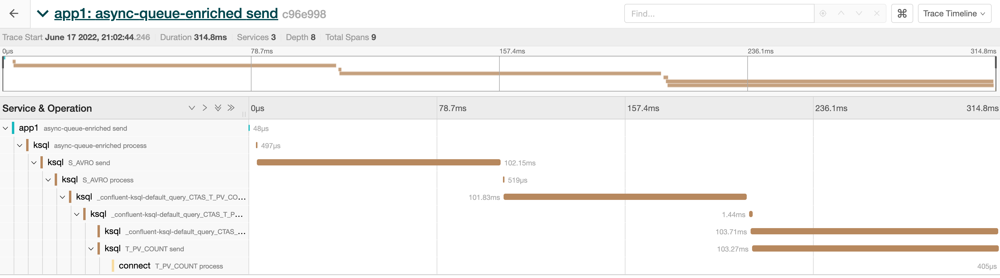
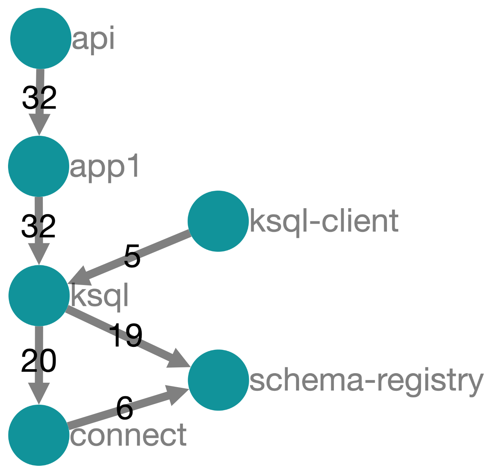

# Otel Playground

## What's this repo about

- [x] Trace API service write Kafka async, show streaming aggregated report.
- [x] Trace simple producer/consumer app.
- [x] Trace ksqlDB/Kafka-Stream.
- [x] Trace Kafka Connect.
- [x] Trace full end-to-end: API -> Kafka -> Python App -> KsqlDB -> Connect.
- [ ] Metric (Kafka, API, Mysql, ksqlDB).
- [ ] Log

|End-to-end tracing, API to Connect.|Tracing DAG.|
|-----------------------------------|------------|
|||

## Environment setup

1. Install `kafka-connect-jdbc` connector.
   ```
   docker run -it -v $PWD/confluent-hub-components:/tmp/confluent-hub-components \
   cnfldemos/kafka-connect-datagen:0.5.0-6.2.1 \
   confluent-hub install --component-dir /tmp/confluent-hub-components --no-prompt confluentinc/kafka-connect-jdbc:10.5.0
   ```

## Services & Pipelines startup

1. Start services. (It will wait Kafka Broker get fully started, it may take up to 30 seconds.)
    ```
    docker-compose up -d
    ``` 

[comment]: <> (2. Setup Mysql)
[comment]: <> (   ```)
[comment]: <> (   docker exec -i mysql mysql -uroot -pmysql-pw example-db < ./init_scripts/mysql/init.sql)
[comment]: <> (   ```)

3. Create ksqlDB pipelines
   ```
   docker exec -it ksqldb-cli ksql http://ksqldb-server:8088 -f /tmp/init_scripts/ksql/init.sql
   ```

4. Create JDBC Sink.
   ```
   curl --location --request POST 'localhost:8083/connectors' \
   --header 'Content-Type: application/json' \
   --data @./init_scripts/connect/config_jdbc.json
   ```

5. Access http://localhost:5001/ to trigger Kafka message write.
6. Access http://localhost:16686/ to view traces.
7. Access http://localhost:9090/targets to view metrics on Prometheus.

## (Optional) Update agents

```
curl -o ./agents/opentelemetry-javaagent.jar https://github.com/open-telemetry/opentelemetry-java-instrumentation/releases/download/v1.14.0/opentelemetry-javaagent.jar
curl -o ./agents/jmx_prometheus_javaagent-0.17.0.jar https://repo1.maven.org/maven2/io/prometheus/jmx/jmx_prometheus_javaagent/0.17.0/jmx_prometheus_javaagent-0.17.0.jar
```

## Notes:

- Otel sends traces to `OTEL_EXPORTER_OTLP_ENDPOINT=localhost:4317` by default.
- Collector forwards traces to `OTEL_EXPORTER_JAEGER_ENDPOINT=localhost:14250` by default.
- Jaeger 6831 accepts trace directly.
- Jaeger 6831 port must be udp, `6831:6831/udp`
- Kafka producers/consumers are decouple, it needs context to connect between services, `./kafka_app.py` shows how to
  switch context.

## References:

- https://open-telemetry.github.io/
- https://opentelemetry.io/docs/instrumentation/python/getting-started/
- https://docs.confluent.io/kafka-connect-jdbc/current/sink-connector/index.html
- https://confluent.io/blog/monitor-kafka-clusters-with-prometheus-grafana-and-confluent/
- https://github.com/prometheus/jmx_exporter
- https://github.com/prometheus/mysqld_exporter
