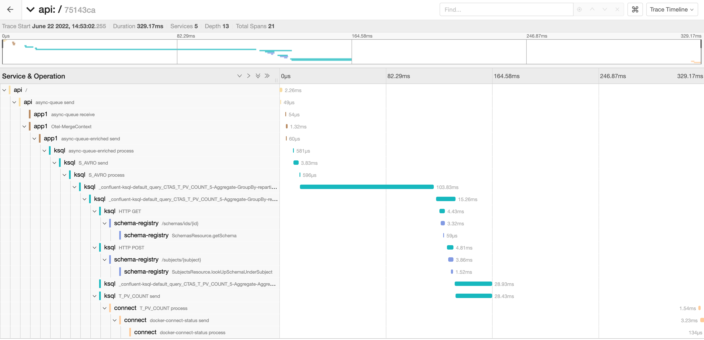

# Otel Playground

## What's this repo about

- [x] Trace API service write Kafka async, show streaming aggregated report. 
- [x] Trace simple producer/consumer app.
- [x] Trace ksqlDB/Kafka-Stream.
- [x] Trace Kafka Connect.
- [x] Trace full end-to-end: API -> Kafka -> Python App -> KsqlDB -> Connect.
- [ ] Metric (Kafka, API, Mysql, ksqlDB).
- [ ] Log

|End-to-end tracing, API to Connect.|Tracing DAG.|
|-----------------------------------|------------|
|||

## Environment setup

1. Download javaagent jar file.
   1. Otel java agent for trace
      ```
      curl -o ./agents/opentelemetry-javaagent.jar https://github.com/open-telemetry/opentelemetry-java-instrumentation/releases/download/v1.14.0/opentelemetry-javaagent.jar
      ```
   3. JMX agent for metrics
      ```
      curl -o ./agents/jmx_prometheus_javaagent-0.17.0.jar https://repo1.maven.org/maven2/io/prometheus/jmx/jmx_prometheus_javaagent/0.17.0/jmx_prometheus_javaagent-0.17.0.jar
      ```

2. Install kafka-connect-jdbc connector. Check how to install confluent-hub [here](https://docs.confluent.io/home/connect/confluent-hub/client.html)
   1. ```
      confluent-hub install --component-dir confluent-hub-components --no-prompt confluentinc/kafka-connect-jdbc:10.5.0
      ```

## Services & Pipelines startup
1. Bring all services up.
    1. Start Kafka and Zookeeper
       ```
       docker-compose up -d broker zookeeper
       ```
    2. Start other services. `web` and `app1` needs to wait Kafka fully started, please run this command multiple times to make sure all the services turn to `Up`.
       ```
       docker-compose up -d
       ```
    3. Check service status 
       ```
       docker-compose ps
       ```

2. Setup Mysql
    1. ```
       docker exec -it mysql mysql -uroot -pmysql-pw example-db
       ```
    2. ```
       GRANT ALL PRIVILEGES ON *.* TO 'example-user' WITH GRANT OPTION;
       ALTER USER 'example-user'@'%' IDENTIFIED WITH mysql_native_password BY 'example-pw';
       FLUSH PRIVILEGES;
       ``` 
    3. ```
       create table T_PV_COUNT(URL varchar(64) not null primary key);
       ```

3. Create ksqlDB pipelines
    1. ```
       docker exec -it ksqldb-cli ksql http://ksqldb-server:8088
       ```
    2. ```
       create stream s_input (url string) with (
         kafka_topic='async-queue-enriched', value_format='json');
      
       create stream s_avro with (
         key_format='avro', value_format='avro') as select * from s_input;
      
       create table t_pv_count as 
       select 
         url,
         latest_by_offset(url) as url_txt,
         as_value(windowstart) as st, 
         as_value(windowend) as ed, 
         count(*) as count 
       from s_avro window tumbling (size 10 second) 
       group by url emit changes;
       ```

4. Create JDBC Sink. 
   1. ```
      curl --location --request POST 'localhost:8083/connectors' \
      --header 'Content-Type: application/json' \
      --data-raw '{
          "name": "sink_result_to_db",
          "config": {
              "connector.class": "io.confluent.connect.jdbc.JdbcSinkConnector",
              "connection.url": "jdbc:mysql://mysql:3306/example-db",
              "connection.user": "example-user",
              "connection.password": "example-pw",
              "key.converter": "org.apache.kafka.connect.storage.StringConverter",
              "key.converter.schema.registry.url": "http://schema-registry:8081",
              "value.converter": "io.confluent.connect.avro.AvroConverter",
              "value.converter.schema.registry.url": "http://schema-registry:8081",
              "topics": "T_PV_COUNT",
              "insert.mode": "upsert",
              "fields.whitelist": "URL,URL_TXT,ED,ST,COUNT",
              "pk.mode": "record_key",
              "pk.fields": "URL",
              "auto.create": "true",
              "auto.evolve": "true"
          }
      }'
      ```
5. Access http://localhost:5001/ to trigger Kafka message write.
6. Access http://localhost:16686/ to view traces.
7. Access http://localhost:9090/targets to view metrics on Prometheus.

## Notes:

- Otel sends traces to `OTEL_EXPORTER_OTLP_ENDPOINT=localhost:4317` by default.
- Collector forwards traces to `OTEL_EXPORTER_JAEGER_ENDPOINT=localhost:14250` by default.
- Jaeger 6831 accepts trace directly.
- Jaeger 6831 port must be udp, `6831:6831/udp`

## References:

- https://open-telemetry.github.io/
- https://opentelemetry.io/docs/instrumentation/python/getting-started/
- https://docs.confluent.io/kafka-connect-jdbc/current/sink-connector/index.html
- https://confluent.io/blog/monitor-kafka-clusters-with-prometheus-grafana-and-confluent/
- https://github.com/prometheus/jmx_exporter
- https://github.com/prometheus/mysqld_exporter
